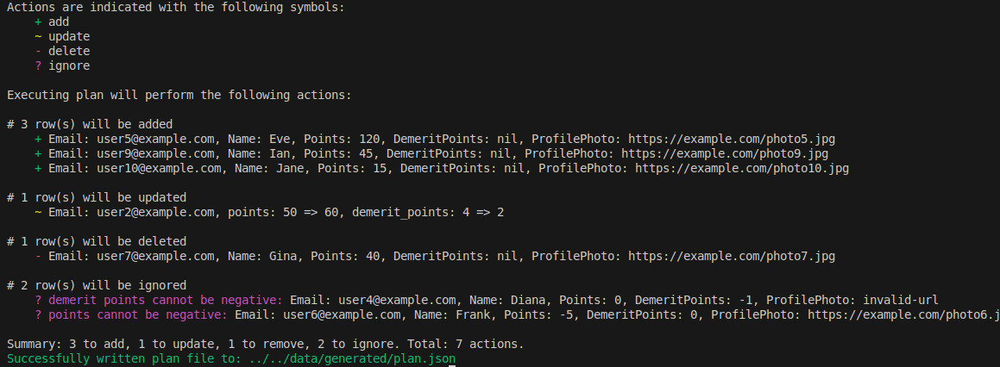
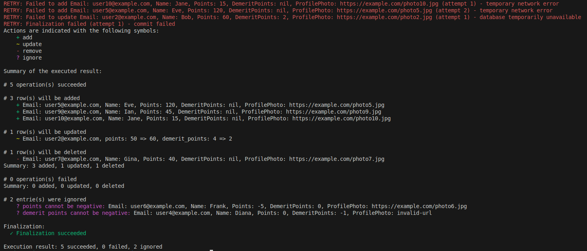

# Planear

**Planear** is a robust Go library for declarative data and infrastructure reconciliation that puts **you in complete control**. Define your desired state in CSV files, let Planear compare it with your actual remote state, and execute custom reconciliation logic **exactly the way you want it**. Unlike infrastructure-as-code tools that lock you into predefined providers, Planear gives you full customizability through simple Go code—no plugin ecosystem, no provider limitations, just pure Go.

## Features

You may wonder... why is Planear created when there are tools like Terraform, Pulumi and Liquibase? Here's a detailed [comparison](./docs/COMPARISON.md) documenting the reason why I created this project!

- **Complete Customizability**: Define your own record types, validation, and execution logic in pure Go
- **Type-Safe Generics**: Handle any record type with full type safety—no type conversion or reflection overhead
- **Declarative State Management**: CSV-driven configuration as single source of truth
- **Custom Callbacks**: Specify `OnAdd`, `OnUpdate`, `OnDelete`, `OnFinalize`, and custom validators to implement exactly what you need
- **Built-in Retry Logic**: Automatic exponential backoff for transient failures
- **Parallel Execution**: Configurable concurrency (default: number of CPU cores)
- **Comprehensive Reporting**: Track successes, failures, and ignored records with full context

## Installation

Requires Go 1.22 or later.

```bash
go get github.com/algebananazzzzz/planear
```

## Quick Start

Planear has **2 simple functions**:

### 1. Generate a Plan

```go
import "github.com/algebananazzzzz/planear/pkg/core/plan"

plan, err := plan.Generate(plan.GenerateParams[YourRecord]{
    CSVPath:           ".",
    OutputFilePath:    "plan.json",
    FormatRecordFunc:  func(r YourRecord) string { return r.String() },
    FormatKeyFunc:     func(k string) string { return k },
    ExtractKeyFunc:    func(r YourRecord) string { return r.GetKey() },
    LoadRemoteRecords: func() (map[string]YourRecord, error) { /* query database */ },
})
```

### 2. Execute the Plan

```go
import "github.com/algebananazzzzz/planear/pkg/core/apply"

err := apply.Run(apply.RunParams[YourRecord]{
    PlanFilePath: "plan.json",
    FormatRecord: func(r YourRecord) string { return r.String() },
    FormatKey:    func(k string) string { return k },
    OnAdd:        func(a types.RecordAddition[YourRecord]) error { /* your logic */ },
    OnUpdate:     func(u types.RecordUpdate[YourRecord]) error { /* your logic */ },
    OnDelete:     func(d types.RecordDeletion[YourRecord]) error { /* your logic */ },
    OnFinalize:   func() error { /* commit, cleanup, etc. */ },
})
```

**That's it!** See [docs/EXAMPLES.md](./docs/EXAMPLES.md) for complete, real-world examples and patterns.

### Visual Overview

**Step 1: Generate a Plan**



**Step 2: Execute the Plan**



## How It Works

### Phase 1: Plan Generation

1. **Load Local Records**: Reads CSV files from specified directory
2. **Load Remote Records**: Fetches current state via user-provided callback
3. **Compute Differences**: Identifies additions, updates, deletions, and ignored records
4. **Validate Records**: Skips invalid records (collected in "Ignores")
5. **Generate Plan**: Creates actionable plan with field-level changes
6. **Output Plan**: Saves plan as JSON file for review before execution

### Phase 2: Plan Execution

1. **Load Plan**: Reads the generated plan from JSON
2. **Execute Operations**: Runs add/update/delete callbacks in parallel
3. **Handle Failures**: Retries failed operations with exponential backoff
4. **Generate Report**: Tracks which operations succeeded and which failed
5. **Finalize**: Executes finalization hook (commits, cleanup, etc.)

## Complete Control

Define custom callbacks for **every step**:

- **`OnAdd`**: Insert logic (your way)
- **`OnUpdate`**: Update logic with field-level change visibility
- **`OnDelete`**: Delete logic (your way)
- **`OnFinalize`**: Commit, notify, cleanup, etc.

No plugin complexity. Pure Go—no provider limitations.

## Core Concepts

### Plan Operations

A plan contains four types of operations:

- **Additions**: Keys in local CSV but not in remote state
- **Updates**: Keys in both but with different values
- **Deletions**: Keys in remote but not in local CSV
- **Ignores**: Local records that failed validation

### Field Changes

Updates include detailed field-level changes so you know exactly what modified:

```go
type FieldChange struct {
    Field    string // Name of changed field
    OldValue any    // Previous value
    NewValue any    // New value
}
```

## Two Simple Entry Points

Planear is **very straightforward**—just two functions:

1. **`plan.Generate()`** - Compare CSV with remote state, generate a plan
2. **`apply.Run()`** - Execute the plan with your custom callbacks

That's it. No complex APIs, no provider ecosystem, no state management complexity.

## Learn by Example

See [docs/EXAMPLES.md](./docs/EXAMPLES.md) for:
- The built-in example (user management system)
- Real-world use cases (LDAP sync, roles/permissions, multi-tenant config, API endpoints)
- Common patterns and advanced usage
- Testing strategies

## Documentation

- [docs/EXAMPLES.md](./docs/EXAMPLES.md) - Usage patterns, real-world scenarios, and best practices
- [docs/COMPARISON.md](./docs/COMPARISON.md) - How Planear compares to Terraform, Pulumi, Liquibase
- [CONTRIBUTING.md](./CONTRIBUTING.md) - How to contribute

## Use Cases

Planear is ideal for:

- **Database Manipulation Language (DML) Management**: Keep database items in sync with CSV definitions
- **User/Permission Management**: Manage users and roles declaratively
- **Configuration Synchronization**: Sync local config files with remote services
- **Data Migration**: Migrate data between systems safely
- **Infrastructure Reconciliation**: Any scenario where you need to reconcile local desired state with remote actual state using custom scripts

## Why Planear?

| Aspect | Planear | Terraform | Custom Scripts |
|--------|---------|-----------|-----------------|
| **Custom Logic** | 100% control via callbacks | Limited by providers | Full control, lots of boilerplate |
| **Declarative + Plan First** | ✅ CSV-driven | ✅ HCL-driven | ❌ Imperative |
| **Type Safety** | ✅ Full Go generics | ❌ Dynamic HCL | ✅ Go type system |
| **Parallel + Retries** | ✅ Built-in | Partial | ❌ Manual |
| **CSV Support** | ✅ First-class | ❌ Not designed | ❌ Not designed |
| **Ease of Use** | Simple (2 functions) | Complex | High effort |

**See [docs/COMPARISON.md](./docs/COMPARISON.md) for detailed comparisons with Terraform, Pulumi, Liquibase, and custom scripts.**

## Performance

- **Parallel Execution**: Configurable worker pool for concurrent operations. Recommendation: Set parallelization to `runtime.NumCPU()` for optimal throughput
- **Efficient Diffing**: O(n+m) algorithm for comparing local vs remote state
- **Streaming CSV**: Handles large CSV files with streaming parser
- **Low Latency**: Pure Go implementation with minimal allocations
- **Example parallelization**:
  ```go
  import "runtime"

  numCores := runtime.NumCPU()
  params.Parallelization = &numCores
  ```

## Error Handling

Planear provides comprehensive error reporting:

- **Validation Errors**: Records failing validation are marked as ignored with reason
- **Execution Errors**: Failed operations are tracked separately for retry/debugging
- **Detailed Messages**: All errors include context (which record, which operation, etc.)

## Testing

```bash
go test ./...
```

## License

[LICENSE.md](./LICENSE.md)

## Contributing

See [CONTRIBUTING.md](./CONTRIBUTING.md) for guidelines on how to contribute.

## Support

For issues, questions, or contributions, please visit the [GitHub repository](https://github.com/algebananazzzzz/planear).
