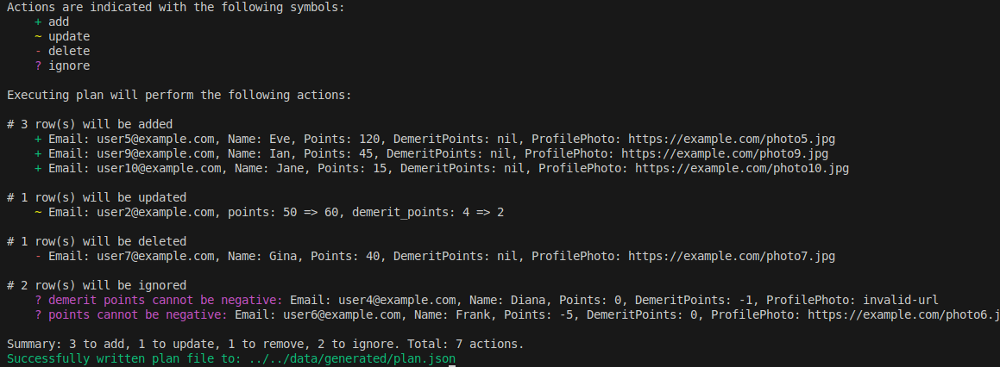
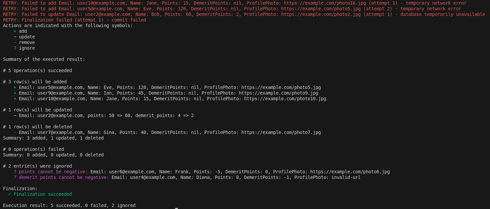

# Planear

[](https://pkg.go.dev/github.com/algebananazzzzz/planear)
[](https://goreportcard.com/report/github.com/algebananazzzzz/planear)
[](https://github.com/algebananazzzzz/planear/releases)
[](LICENSE)

**Planear** reconciles a CSV-defined desired state with a remote actual state. You write `OnAdd`, `OnUpdate`, `OnDelete` in Go — Planear handles the diff, the plan file, parallel dispatch, and retries.

No providers, no plugins, no state-file format to learn. Just two functions.

## Installation

Requires Go 1.22 or later.

```bash
go get github.com/algebananazzzzz/planear
```

## Quick Start

### 1. Generate a Plan

```go
import "github.com/algebananazzzzz/planear/pkg/core/plan"

plan, err := plan.Generate(plan.GenerateParams[YourRecord]{
    CSVPath:           ".",
    OutputFilePath:    "plan.json",
    FormatRecordFunc:  func(r YourRecord) string { return r.String() },
    FormatKeyFunc:     func(k string) string { return k },
    ExtractKeyFunc:    func(r YourRecord) string { return r.GetKey() },
    LoadRemoteRecords: func() (map[string]YourRecord, error) { /* query database */ },
})
```

### 2. Execute the Plan

```go
import "github.com/algebananazzzzz/planear/pkg/core/apply"

err := apply.Run(apply.RunParams[YourRecord]{
    PlanFilePath: "plan.json",
    FormatRecord: func(r YourRecord) string { return r.String() },
    FormatKey:    func(k string) string { return k },
    OnAdd:        func(a types.RecordAddition[YourRecord]) error { /* your logic */ },
    OnUpdate:     func(u types.RecordUpdate[YourRecord]) error { /* your logic */ },
    OnDelete:     func(d types.RecordDeletion[YourRecord]) error { /* your logic */ },
    OnFinalize:   func() error { /* commit, cleanup, etc. */ },
})
```

See [examples/](./examples) for a runnable user-management example, and [docs/EXAMPLES.md](./docs/EXAMPLES.md) for patterns and additional use cases.

### Visual Overview

| Step 1: Generate a Plan | Step 2: Execute the Plan |
| --- | --- |
|  |  |

## Features

- **Pure Go callbacks** — `OnAdd`/`OnUpdate`/`OnDelete`/`OnFinalize` are functions you write. No DSL.
- **Type-safe generics** — works with any struct, no reflection on your records.
- **CSV in, plan-file out** — plan is a reviewable JSON artifact written before any callback fires.
- **Parallel execution with retries** — configurable worker pool, exponential backoff on transient failures.
- **Optional dependency ordering** — set `DependsOn` and Planear topologically sorts the plan into layers for safe FK ordering. See [docs/LAYERED_EXECUTION.md](./docs/LAYERED_EXECUTION.md).
- **Configurable finalize policy** — pick when `OnFinalize` runs (always / only on full success / on any progress) via `FinalizeOn`.

## How It Works

**Plan phase** — load CSV, call `LoadRemoteRecords`, diff the two, validate, write `plan.json`. With `DependsOn` set, also build the dependency DAG, topologically sort it into layers, and embed them in the plan. Cycles surface as errors *before* the file is written.

**Apply phase** — read `plan.json`, dispatch operations to a worker pool with retries. Layered mode walks layers in order with a hard barrier between them; if a layer fails, remaining layers' ops are recorded as `Skipped` rather than executed. `OnFinalize` runs subject to `FinalizeOn`.

## Plan Operations

A plan contains:

- **Additions** — keys in local CSV but not in remote state
- **Updates** — keys in both but with different values (includes per-field `OldValue`/`NewValue`)
- **Deletions** — keys in remote but not in local CSV
- **Ignores** — local records that failed validation, with the reason
- **Layers** *(optional)* — populated when `DependsOn` is provided

## Performance

Set `Parallelization` to `runtime.NumCPU()` for CPU-bound callbacks, higher for network-bound ones:

```go
numCores := runtime.NumCPU()
params.Parallelization = &numCores
```

## Documentation

- [docs/EXAMPLES.md](./docs/EXAMPLES.md) — usage patterns and additional scenarios
- [docs/LAYERED_EXECUTION.md](./docs/LAYERED_EXECUTION.md) — dependency-aware layering deep dive
- [docs/COMPARISON.md](./docs/COMPARISON.md) — how Planear compares to Terraform, Pulumi, Liquibase
- [docs/TESTING.md](./docs/TESTING.md) — running tests, `testutils/` helpers
- [docs/RELEASING.md](./docs/RELEASING.md) — how releases are cut

## License

[MIT](./LICENSE)
